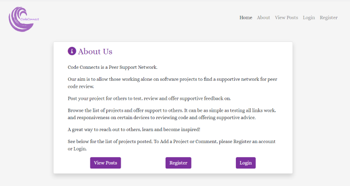
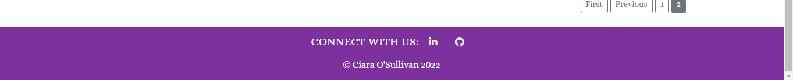

# **Code Connects**

## Overview

Code Connects is a website that aims to create an online peer code review community.  This site allows people to share their personal or educational software development projects they are working on with others in the hope of having fresh eyes on their code and having a user base to test their deployed projects on others.

Users can login, post their project description, source code and deployed sites so that others can view, comment and make suggestions.  This site also aims to help people learn from each other’s ideas, suggestions and mistakes in a supportive online community.

View the live project [Here]( https://code-connects.herokuapp.com/)

[Am I Responsive]()

## User Experience (UX)

### User Stories

As a user I want to:

*	Easily understand the main purpose of the site, so that I can learn more about how to use the site.
*	Easily navigate around the site, so that I can find content and understand where I am on the site.
*	Be provided with a summary of all posts by most recent first so that I can glance through quickly to decide which post to read in full.
*	Read other users’ posts in full detail and comments related to those posts so that I can decide to review and offer feedback to that user and not repeat other suggestions from comments by other users.
*	Register my account, so that I can post my projects, update and delete them if I wish.
*	Register my account, so that I can comment on other’s posts, update and delete my comments if I wish.
*	Easily log in and log out of my account, so that I can access my personal information.
*	View my profile so that I can update my information such as username, email and profile image.
*	Find links easily so that I can contact the site owner if needed.
*	 Clearly see what user posted which projects and comments so that I can make a connection.
*	See clearly what date a post or comment was created so that I can clearly see how relevant and up to date the information is.
*	 Clearly see how many comments are attached to a post before clicking in to read it fully so that I can decide to read and also comment depending on whether others have commented already.
*	Post my projects to the site so that I can connect with others and receive feedback on my project.
*	Update and delete my own project posts so that I can keep the information up to date or fix any mistakes I notice.
*	Comment on my own project posts so that I can reply to other users’ comments
*	Comment on other user’s projects so that I can connect with others by giving feedback
*	Update or delete my comments so that I can keep the information up to date and relevant or fix any mistakes I notice.
*	Access the site on various devices such as desktop, tablet or mobile to that I can use the site no matter what device I have to hand.
*	Understand when an error occurs so that I am given clear feedback on what I should do.
*	Be aware when my actions have had a successful outcome so that I know when I have updated or deleted a post or comments or if I am logged in or out successfully.

### Agile Approach in this Project

An Agile Approach was used to develop this site.  That is, each activity was broken down into small bite-sized portions and performed iteratively, so that as it was repeated, it was tweaked and improved on with each cycle.  According to a report from the [Standish Group (2018)](https://standishgroup.myshopify.com/), Agile projects are statistically twice more likely to succeed, and a third less likely to fail than waterfall projects.

To complete the overall aim of the Code Connects idea, 9 Epics were formed (documented under GitHub Issues) and these then were broken down into specific tasks called User Stories.  These User Stories are small, self-contained units of development work designed to accomplish a specific goal.  These User Stories then had acceptance criteria attached for each so that it was clear when the User Stories were achieved as each of these conditions were met.  The acceptance criteria where then further broken down into tasks.  These tasks were the list of actions required to implement the User Story. They described the technical work details and activities to be performed to complete each User Story properly.

**Example:**

    **Epic - User Account**

    User Story - Profile Page:

    As a User, I would like to be able to easily view my profile page so that I can update my account from there and display the information I would like others to see

    Acceptance Criteria 1
    Given that I am a registered user who is logged in
    When I click the Profile link in the navigate bar
    Then I am taken to my profile page and can see my details displayed

    Acceptance Criteria 2
    Given that I am a registered user who is logged in
    When I navigate to my profile page and edit my details
    Then I can click an update button and be alerted that my information was updated successfully.

    Tasks:
    *	create a profile app for users’ functionality
    *	create signal to create a user profile when a new user signs up
    *	link up views & templates & URLs and display link to profile page in nav after user is logged in
    *	display logged in users name on the profile page
    *	create a profile model to add profile picture, contact details such as email
    *	create form to allow users to be able to edit the information displayed on their profile page
    *	add update button for users to click to submit their changes
    *	show success message when user profile update
    *   manually test this works

Story points estimated the effort required to complete a particular User Story in one iteration.  To create a Product Backlog GitHub Milestones was used to track progress on groups of issues relating to the User Stories.

Timeboxing defined the iteration where the User Stories were developed based on the assigned priority.  The MoSCoW Prioritization technique was used to assign priorities for Product Backlog Items to be completed in a particular time box.  GitHub Labels was used to categories the User Stories into Must Have, Should Have and Could Have. This clearly showed which User Stories were more important to implement first and in what order.  This kept the scope of the project in focus at all times and only implemented what was essential first.

Information radiators in Agile show real-time, informative and straightforward work status.  This project used a Kaban board, which was set up in GitHub Projects to help keep track of work to do, in progress and completed.

Within the timeframe work stopped with over 73% of the timebox User Story points total of all Must Have and some Should Have prioritised User Stories.  Only 1 Should Have and 3 Could Have were left uncompleted and are documented in the future features section below.

## Features

This website takes the users stories mentioned above into consideration to create a positive UX.  The users stories are discussed in more detail below with examples of how each is implemented.

1. **Favicon**

A customised favicon was created using a free image from [WikiMedia Commons](https://commons.wikimedia.org/wiki/File:MILE_WAVE_LOGO.svg), designed further in [Microsoft 3D Paint](https://apps.microsoft.com/store/detail/paint-3d/9NBLGGH5FV99) and generated on [Real Favicon Generator](https://realfavicongenerator.net/).  This favicon is visible on browser tabs, bookmarks, history archives and so on to help users save time by allowing them to identify and browse the website without difficulties.

2. **Header**

The Header is intentionally fixed to the top of the screen, this was considered useful to the user to navigate with ease without having to constantly scroll up and down no matter what page they are on. The colour choice of light gray for background and black for the font was chosen to contrast each other for reading accessibility.

*   Logo

    * A customised logo was created using a free image from [WikiMedia Commons](https://commons.wikimedia.org/wiki/File:MILE_WAVE_LOGO.svg) and designed further in [Microsoft 3D Paint](https://apps.microsoft.com/store/detail/paint-3d/9NBLGGH5FV99). 
    
    * This logo is positioned in the top left of the navigation bar.  The logo is linked to the landing page for ease of navigation for the user, no matter what section they are on they can click the logo in the top left to navigate back.
    
    * The logo is designed to have the purple themed colour of the website and contains the website's name beside the icon. This is to help it be consistant witht he site's colour scheme.

*   Navigation Bar
    * The header also contains the navigtion bar. This is conventionally located on the top right for larger screens and is adjusted to a hamburger icon for smaller screens to aid responsiveness.

    * The navigation bar contains key words that link to each section of the website. Again this is designed to for ease so the user can navigate instantly without having to scroll, if they wish.

    * The navigation links, when hovered over, respond by expanding slightly, changing to a purple colour and having a line appear underneath to inform the user that it is interactive.

        

        

3. **Landing Page**

    *   A gif from [Gifer](https://gifer.com/en/79qS) was carefully chosen as a background image to make the landing page stand out from other websites.  This gif was then recorded and edited using [Flashback Express](https://www.flashbackrecorder.com/express/).  It was trimmed and slowed down and then compressed online with [Free Convert](https://www.freeconvert.com/video-compressor).

    *   This specific video was chosen as the movement is interesting, it compliments the site's purple colour theme and is relevant to the theme of people connecting.  The video was not looped and it was muted so that it is not interactive and stays as a background feature for the user for a few seconds as the user lands on the home page.

    *   The video is fixed into position so that it disapppears as the user continues to the main content so that it does not become too distracting as the amount of text to read increases.

    *   The landing page also contains the title of the website and its subtitle. A white font with a drop gray shadow was used for contrast for reading accessibility and consistancy with colours used in the header.  CSS animation and keyframes was used as an effect to slowly fade the text in as the video comes to an end.

    *   The landing page was designed not to show any hint of content below to allow the background video to take effect and the landing page to be decluttered for the user before they continued with the site.  Because of this design feature then, an explore button linked to the first section, called About Us, was added. This explore button's aim is to invite the user to interact and encourage them to continue on reading. The user can also scroll but the explore button adds an extra feature incase the instinct to scroll does not happen when there is no hint of content below the landing page.

    *   The explore button is also white for contrast for reading accessibilty.

https://user-images.githubusercontent.com/93194443/178119696-13c2d674-e4f2-4abd-a467-62f54211fe9f.mp4

4. **About Us**
    
    *   The About Us section contains important information the user needs to know about the site and its purpose.

    *   It also directs them to scroll for the rest of the content on the site.

    *   Bootstrap 5 card was used with a shadow to create a 3D layered effect on the screen and the text colour used was the dark purple to keep consistancy throughout the site with the header and footer.

        

5. **Post List View**

On the home page, Django’s generic class-based ListView was used to list all the users project posts.  There is also a link in the navigation bar which takes the user to the top of the post list so this too can make it easy for the users to navigate.

For each project post the list displays the title of the project, the date posted, how many comments are associated with that particular post and the users name and profile picture. 

The first 100 characters of the project description is displayed by using |slice to give a very short snippet of what the project is about.  As Sunmmernote is used for the user to enter in their project description, the project list uses |striptags to stop the html tags from Summernote displaying on the page and then escape HTML for safety using the |safe tag.

The posts are listed with the newest first and they are paginated after every 6 posts.  The pagination is designed to not only show the page numbers but also the first, previous, next and last page to make it easy for the user to navigate.

[Pagination](README/assets/pagination-screenshot.png)

6. **Post Detail View**

When the user clicks the title of the project in the post list view on the home page, they are taken to a separate page that shows this post in detail.  Django’s generic class-based DetailView was used to display each of the instances of the table in the database so that only that chosen post and its related details will show on this page.  

Here the user can read the post in full, along with all the other details such as author’s name, profile picture and date posted.  The user can also see any links the author has posted that will take them to the author’s deployed site or code repository.  These will open in a new tab to make navigation easier for the user.

Also, on each of these post detail view pages the user can see any comments related to the post, the number of comments listed, the name of the user who wrote the comment, their profile picture and date posted.  The comments are displayed as oldest first to make it easy for the user to follow the thread of conversation.  The comments are paginated after every 6 comments and just like the post list page, the pagination shows not only the page numbers but first, previous, next and last to make navigation easy for the user.

If there are no comments yet for a post, a message will show, notifying the user of this and inviting them to be the first to comment on the post.

7. **Creating a Comment**

If the user is not signed in, then they will not have permission to post a comment.  If the user is not logged in and on the post detail page, then they will see a message asking them to sign in if they want to comment.  The button then takes them to the sign in page.  

After signing in, the user is then automatically taken back to that particular post detail page to make navigation easy for the user.  This is achieved by using ?next={{request.path}}.  This adds a URL parameter next containing the address of the current page, to the end of the linked URL.  After the user has successfully logged in, the views will use this "next" value to redirect the user back to the page where they first clicked the login link, which is the post detail view page.

Once logged in then the user will see their profile picture and name beside a form.  It notifies the user that they will be commenting as their username.  Once the user has written their comment and clicked the submit button, they are alerted that their comment was successfully added and are taken back to the post detail page where they can view their comment if they wish.  Again, this is set up to help with ease of navigation for the user.

8. **Updating & Deleting a Comment**

If the user is logged in the option to update or delete their comment is displayed beside any comment they wrote.  

If the user chooses to update, then they are presented with the comment form, already prepopulated with their comment so they can amend as needed and resubmit.

If the user decides to delete their comment, they are taken to a separate page and asked if they are sure before deciding to permanently delete.  This is to provide a safety net in case the user changes their mind or clicked the delete button by mistake.

9. **Creating a Post**

If the user is logged in, then they can create a post.  The link to creating a post then displays on the navigation bar once the user has logged in.

The user is taken to a form with a WYSIWYG editor called Summernote to help them format their content by adding different headings, links, images etc.

Once the user has submitted their post, they are taken to that post’s detail page where they can see it displayed.

The user can also navigate to the post list view on the home page and see their post listed there too.

10. **Updating & Deleting a Post**

If the user is logged in the option to update or delete their post is displayed beside any post they wrote.  

If the user chooses to update, then they are presented with the post form, already prepopulated with their post’s details so they can amend as needed and resubmit.

If the user decides to delete their post, they are taken to a separate page and asked if they are sure before deciding to permanently delete.  This is to provide a safety net in case the user changes their mind or clicked the delete button by mistake.

The user is alerted to their actions by success messages appearing at the top of the page.

11. **Profile Page**

Once a user registers, they will have a profile page automatically created for them.  The link to their profile page appears in the navigation bar once they are logged in.  On this page the user can choose to update their profile information such as username, email address and profile image.  If no image is chosen, then a default profile image is provided.

12. **Register, Sign In & Log Out**

As described in the future features section of this README, it is hoped that this project will be expanded to provide support for third-party (social) authentication via services like Github or Gmail.  As Django does not support this automatically, allauth was installed and used to create the register, sign in and log out functionality, so the project will already have the foundations in place to expand on this functionality in the future.

At present to register, the user is not required to provide an email address.  This was decided on because there is no use for it yet then the user should not be asked for it at this stage, so their private details are not being stored if they are not needed.  In time as the scope of the project expands, for example, sending email notifications or recovered password functionality, then this may become a requirement for the user to provide.

As previously described, once a user is logged in the navigation bar will change to display the different features the user has access to.

13. **Admin User**

A superuser was created for this project to manage the administration section.  Admin users have more functionality than regular users and can allow them to create, read, update and delete information such as users, profiles, posts and comments.  Only approved admin users can access this section of the site and can do so by adding /admin to the URL home page.  It was decided at this time not to provide a link to this on the site but could be a future feature to allow easier navigation for any admin users. 

14. **Footer**
    *   The Footer contains the Connect with Us section.  The background and font colours are kept consistant with the theme of the site.

    *   The GitHub & LinkedIn icons from [Font Awesome](https://fontawesome.com/) open in a new tab and take the user to the respective sites to connect.

    *   The Footer also contains a copyright and the authours name.
        
        

15. **Error Pages**

Custom Error Pages were created to support the professionalism design and ensure appropriate link was added back to the main site to guide users who come across these messages.
    *   400 Bad Request
    *   403 Page Forbiden
    *   404 Page Not Found
    *   500 Server Error

### Features Left to Implement

## Design

### Wireframes
### Fonts
### Colour Scheme

## Testing

### Validator Testing

## Deployment

### Version Control
### Cloning

## Credits
### Content

*   [Bootstrap 5 Classes Cheatsheet](https://www.studytonight.com/bootstrap/how-to-align-bootstrap-5-navbar-items-to-the-right)

*   [Bootstrap 5 Move Nav Links Right](https://www.studytonight.com/bootstrap/how-to-align-bootstrap-5-navbar-items-to-the-right)

*   [Bootstrap Footer Ideas](https://mdbootstrap.com/docs/standard/navigation/footer/): A mix of these were used with customised styling

*   [Net Ninja Model Methods](https://www.youtube.com/watch?v=ERCt6HUcaFw): Used to learn how to make a model method to show a snippet of the description on home page

### Media

*   [Image for Customising Logo](https://commons.wikimedia.org/wiki/File:MILE_WAVE_LOGO.svg)

## Acknowledgements

